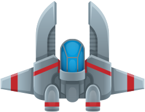

## 背景

想真正搞懂一个游戏是怎么"跑起来"的，光看引擎封装好的 API 是不够的——渲染循环、帧同步、对象管理这些底层的东西，往往被 Unity、Godot 这类引擎藏在了背后。

所以我选了一条更"裸"的路：用 **C++17 + SDL2**，不借助任何游戏引擎，从窗口创建、事件循环到渲染，一行行自己写一个完整的 2D 太空射击游戏。

项目的起点是 B 站 UP 主 ZiyuGameDev 的 SDL2 教程，但我没有停在"跟着敲完"这一步——在教程的骨架上，我重写了架构里的几处、并加了一整套自己的玩法和工程化改造。这篇就是这个过程的复盘。

## 技术栈

- **语言**：C++17
- **图形/事件**：SDL2
- **扩展库**：SDL2_image（PNG 纹理）、SDL2_ttf（TrueType 字体渲染 UI 与排行榜）、SDL2_mixer（背景音乐 + 音效）
- **构建**：CMake（>= 3.20），跨 Windows(MinGW) / Linux / macOS 三平台
- **规模**：`src/` 约 1400 行 C++，另含完整美术、音乐、音效资源

## 我的角色

从零到打包发布全部我一个人：架构设计、玩法编码、参数调优、跨平台构建、以及最后 Windows 端的 v1.0 打包（解压即玩）。

代码上我把整个游戏组织成了两个核心抽象：

**1. 单例 Game + 场景状态机**

`Game` 用静态局部变量做单例，持有窗口、渲染器、主循环、全局分数和排行榜。游戏的不同阶段拆成三个场景，都继承自 `Scene` 抽象基类：

- `SceneTitle`：标题页
- `SceneMain`：核心玩法
- `SceneEnd`：结算 + 输入名字 + 写排行榜

`Game::changeScene()` 负责切换当前场景，事件、更新、渲染三件事统一转发给 `currentScene`。这样每个场景只管自己的逻辑，主循环干干净净。

**2. 数据驱动的对象设计**

所有游戏对象（玩家、敌人、双方子弹、爆炸、掉落物、背景）都是 `Object.h` 里的纯数据 `struct`，字段就是位置、速度、血量、冷却这些。玩法逻辑集中在 `SceneMain` 里用 `std::list` 管理各类对象的生灭。数据和逻辑分离，加新对象或调数值都很轻。

## 难点与解决

**① 帧率无关的运动**
如果直接用"每帧移动 N 像素"，游戏在 144Hz 和 60Hz 的机器上速度就会不一样。解决办法是引入 `deltaTime`：所有位移都写成 `speed * deltaTime * scale`，让运动跟真实时间挂钩，而不是跟帧数挂钩。这样任何刷新率下手感一致。

**② 多分辨率自适应**
不同显示器分辨率差异很大。我用一个统一的 `scale` 缩放因子：窗口按屏幕高度的 90% 生成、保持 3:4 比例，然后所有精灵尺寸、移动速度、UI 元素都乘以这个因子。一套代码在任何屏幕上比例都不崩。

**③ 存档到底该放哪**
最初排行榜写在项目根目录，结果一打包发布、或者重新下载，存档就丢了。后来改用 `SDL_GetPrefPath` 写到系统的用户数据目录（Windows 下是 `AppData/Roaming`）。这才是正确做法——存档跟着用户走，不跟着程序目录走。排行榜本身用 `std::multimap<int, string, greater<int>>`，插入即自动降序，省掉手动排序。

**④ 让战斗"有感觉"**
教程原版打起来偏平淡。我做了几处玩法改造：敌方子弹会计算指向玩家的方向做**追踪**；玩家改成**三连发**、形成横向弹幕；难度**随时间递增**（开局一分钟后刷怪率按 `3 + (elapsed-60000)/5000` 增长、封顶 8）；再配上精灵表爆炸动画、掉落物撞墙反弹三次、两层星空视差滚动。这些叠起来，手感和节奏就明显不一样了。

## 成果与收获

- 一个**从窗口到发布完整闭环**的 2D 游戏，Windows 端解压即玩（`dist/SDLSpaceShooter_v1.0.zip`）。
- 真正理解了游戏循环的本质：**输入 → 更新（含 deltaTime）→ 渲染**，以及为什么帧率无关这么重要。
- 练到了几个能迁移到任何项目的工程能力：单例与状态机的取舍、数据/逻辑分离、跨平台 CMake 配置、以及"存档/配置该放系统哪个目录"这种容易踩的实际问题。
- 最大的体会是：**跟教程只是起点，真正学到东西是在你开始改它、加自己的想法之后。** 平衡性、追踪弹、难度曲线、自适应缩放这些，都是教程之外自己啃下来的。

> 源码：[github.com/Andymaster007/SDLSpaceShooter](https://github.com/Andymaster007/SDLSpaceShooter)
> （项目基于 ZiyuGameDev 的 SDL2 教程起步，在其基础上做了架构与玩法的二次开发。）
